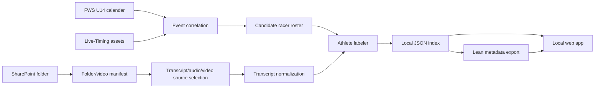

# Ski Video Companion Design And Implementation Plan

## Goal

Build a local-first web app and indexing pipeline for Palisades Tahoe team skiing videos stored in SharePoint. The app should let an operator select a team/event folder, process the videos, infer athlete labels from transcripts and race context, and publish a lean searchable metadata index whose video results link back to the original SharePoint files for playback.

The system must support a heavy local processing workspace while keeping a publishable app/data bundle that does not host media files.

## Non-Goals For The First Implementation Slice

- Do not host or redistribute SharePoint videos.
- Do not implement visual skier matching yet.
- Do not assume Microsoft Graph credentials are available.
- Do not require a JavaScript framework or package installation before the first runnable prototype.

## Operating Model

The project has two runtime modes.

### Indexer Workspace

The indexer workspace is local and can contain large artifacts:

- mirrored SharePoint video files
- extracted audio
- Microsoft/Teams transcripts
- generated transcripts
- downloaded Live-Timing assets
- intermediate manifests
- processing logs
- athlete labeling evidence

The workspace is disposable and rebuildable from SharePoint and public race sources when credentials and source access are available.

### Lean Search App

The lean app contains only:

- event/folder metadata
- video metadata
- athlete label metadata
- transcript snippets/evidence
- Live-Timing source links
- SharePoint playback links

It excludes local video, local audio, private credentials, and large raw processing artifacts.

## Data Sources

### SharePoint Team Folder

Root folder:

`https://alterramtnco.sharepoint.com/:f:/s/TeamPalisadesTahoeShared/IgCyzteAf9SbQ4aGoEO1VqmZAWP2Px2acNgFwKn3reHavTs?e=FYefRv`

Preferred access path:

1. Microsoft Graph / SharePoint API.
2. SharePoint REST through the anonymous shared-link session when Graph credentials are not configured.
3. Browser-assisted listing/download fallback.
4. Manual manifest import when automated access is blocked.

The SharePoint adapter should discover:

- event folders
- video files
- canonical playback links
- download URLs where permitted
- modified timestamps
- item IDs
- sibling transcript files
- audio-only renditions if exposed by the provider

Anonymous folder shares do not guarantee anonymous direct file playback links. For the current TPT U14 SharePoint source, the root folder share opens from a fresh browser state, but raw file URLs and SharePoint's own `:v:/r/...` direct file URL can require sign-in until the browser has opened the root folder share. File-level sharing metadata for a sample video (`P1000316.MP4`) did not expose an existing anonymous per-file link. Treat `sharepointUrl` as a provider view target, not as a guaranteed no-cookie playback URL, unless an authenticated Microsoft Graph/SharePoint operation has generated and verified a file-level anonymous link.

### Microsoft/Teams Transcripts

Transcript discovery should run before media download. If Microsoft-generated transcript files or Stream transcript assets are available, they are preferred over generating new transcripts.

Transcript priority:

1. Microsoft/Teams transcript.
2. Existing audio-only rendition.
3. Extracted audio from full local video mirror.

### Far West U14 Calendar

Public schedule page:

`https://fwskiing.org/events/u14-schedule-results/`

The event adapter should extract event names, dates, venues, links, disciplines, and result references where available.

### Live-Timing

Race search/listing:

`https://live-timing.com/races.php`

For each matched event, collect relevant assets:

- race pages
- start lists
- result pages/files
- racer names
- bibs
- clubs
- gender/category
- discipline/run labels

The parsed racer list becomes candidate context for athlete labeling.

## High-Level Architecture



## Metadata Model

### Folder/Event Record

```json
{
  "id": "folder_...",
  "source": "sharepoint",
  "name": "event folder name",
  "path": "Team Folder/Event Folder",
  "sharepointUrl": "https://...",
  "discoveredAt": "2026-05-10T00:00:00.000Z",
  "eventMatch": {
    "canonicalName": "U14 event name",
    "date": "2026-01-15",
    "venue": "Venue",
    "discipline": "GS",
    "confidence": 0.82,
    "reasons": ["date token matched", "venue matched"],
    "sources": ["https://fwskiing.org/...", "https://live-timing.com/..."]
  },
  "raceAssets": [
    {
      "type": "start_list",
      "label": "Boys GS Start List",
      "sourceUrl": "https://live-timing.com/...",
      "localPath": "data/raw/live-timing/..."
    }
  ],
  "candidateRoster": [
    {
      "name": "First Last",
      "bib": "42",
      "club": "PT",
      "category": "U14",
      "sourceUrl": "https://live-timing.com/..."
    }
  ]
}
```

### Video Record

```json
{
  "id": "video_...",
  "folderId": "folder_...",
  "filename": "clip.mp4",
  "sharepointUrl": "https://...",
  "downloadUrl": "https://...",
  "localVideoPath": "data/media/...",
  "localAudioPath": "data/audio/...",
  "transcript": {
    "source": "microsoft_transcript | audio_only_transcription | video_audio_extraction | unavailable",
    "text": "normalized transcript text",
    "segments": [],
    "localPath": "data/transcripts/..."
  },
  "transcriptRef": {
    "source": "local_mlx_whisper",
    "localPath": "data/transcripts/.../transcript.json",
    "model": "mlx-community/whisper-small-mlx",
    "textLength": 9,
    "segmentCount": 1
  },
  "athleteLabels": [
    {
      "name": "First Last",
      "confidence": 0.86,
      "source": "audio_transcript",
      "evidence": "Name heard near start of clip",
      "matchedRoster": true,
      "methodVersion": "audio-text-v1"
    }
  ],
  "processing": {
    "status": "pending | indexed | needs_review | failed",
    "errors": [],
    "processedAt": "2026-05-10T00:00:00.000Z"
  }
}
```

### Future Visual Evidence Record

The first implementation only reserves schema space for this evidence type.

```json
{
  "name": "First Last",
  "confidence": 0.54,
  "source": "visual_similarity_propagation",
  "sourceVideoId": "video_confident_audio_match",
  "similarityScore": 0.82,
  "discountFactor": 0.65,
  "methodVersion": "visual-propagation-v1"
}
```

Visual labels must not overwrite stronger manual or transcript labels.

## Processing Flow

### One Event Prototype

1. List SharePoint folders and choose one event folder.
2. Generate a manifest for that event folder.
3. Correlate the folder to the Far West U14 calendar and Live-Timing.
4. Download/parse event racer assets.
5. Resolve transcript/audio/video source for each video.
6. Reuse Microsoft transcripts where available.
7. Extract audio with `ffmpeg` only when needed.
8. Transcribe audio locally with Apple Silicon optimized MLX Whisper on the M1 MacBook. Use OpenAI transcription only as an optional fallback when explicitly configured.
9. Label athlete names using transcript text plus candidate roster context.
10. Store metadata in the local index.
11. Verify search returns SharePoint playback links.

Current validation target:

- Shared-link REST listing found the U14 `2025-2026` folders.
- `GS Dec 30, 2025` was validated as a practice folder and is no longer the race validation target because Live-Timing may not have an official event for it.
- Current race validation folder: `GS Race Jan 9. Northstar. Day 1`.
- Folder manifest contains 117 MP4 files.
- Live-Timing daily archive for `2026-01-09` correlates this folder to two sibling races: `297661` men and `297652` women, both Northstar Resort Giant Slalom / CA Challenge Series.
- Live-Timing race-data AJAX payloads provide 160 candidate racers, including 74 TPT/TPTA racers, for fuzzy transcript label correction.
- Initial processed clip `P1000251.MP4` downloads from SharePoint, extracts audio with the static `imageio-ffmpeg` binary, transcribes locally with MLX Whisper, stores the full transcript artifact separately, and labels `Jack Baker` from transcript text `Jack, run one.`.
- Two additional small clips processed cleanly but remain `needs_review` because the transcript did not contain a usable athlete name.

### Batch Mode

After one event is validated:

1. Process all folders incrementally.
2. Skip unchanged videos.
3. Respect API and download throttling.
4. Track per-folder successes, failures, and low-confidence labels.
5. Export lean metadata for publishable search/browse.

## Athlete Labeling Strategy

Evidence priority:

1. Manual correction.
2. Microsoft/Teams transcript.
3. Generated transcript from audio-only media.
4. Generated transcript from extracted video audio.
5. SharePoint filename/folder context.
6. Matched Live-Timing racer roster.
7. Future visual similarity propagation.

The racer roster is a spelling and candidate hint, not proof. A roster match can increase confidence only when there is transcript, filename, or manual evidence.

Transcription and labeling are separate stages. Full transcript artifacts are stored under `data/transcripts/` and referenced from video metadata through `transcriptRef`. Labeling reads the full transcript plus event context, Live-Timing start lists, and any known TPT roster aliases, then writes separate `athleteLabels` evidence records.

Fuzzy name matching is required because skiing audio is often short, noisy, and phonetically ambiguous. The deterministic labeler should compare transcript observations against candidate rosters with exact matching, partial-name matching, edit-distance similarity, and phonetic matching. For example, a transcript observation like `Claydon` may be a low-confidence raw transcript label by itself, or a higher-confidence canonical roster match if the event start list contains a plausible TPT athlete such as `Clayton ...`.

## App UX

The first screen is the actual working indexer/search interface, not a marketing page.

Core views:

- Dashboard: processing status and data counts.
- Folders: list known SharePoint/event folders and start processing.
- Search: search athlete names and open SharePoint playback links.
- Events: inspect event matches, race assets, and candidate rosters.
- Review: list low-confidence or failed videos.

## Implementation Plan

### Phase 1: Local Scaffold

- Create dependency-light Node project.
- Add design doc, README, `.env.example`, `.gitignore`.
- Add local JSON data store.
- Add CLI entrypoint.
- Add HTTP server with static frontend and JSON APIs.

### Phase 2: Event Source Adapters

- Implement Far West page fetch/parser.
- Implement Live-Timing search, daily archive, race page, and AJAX race-data fetch hooks.
- Implement folder-to-event matching heuristics.
- Store event matches and candidate rosters.

### Phase 3: SharePoint Adapter

- Implement Microsoft Graph helper with:
  - shared-link encoding
  - optional client credentials token
  - optional direct bearer token
  - folder children listing
  - recursive event folder listing
- Add manual manifest import fallback.
- Preserve browser-assisted fallback extension points.

### Phase 4: Media And Transcript Pipeline

- Implement source resolver:
  - existing transcript
  - audio-only file
  - local mirrored video
- Add video download/cache helpers.
- Add `ffmpeg` audio extraction wrapper.
- Add local MLX Whisper transcription wrapper as the default on Apple Silicon.
- Add OpenAI transcription wrapper as an optional fallback.

### Phase 5: Labeling And Indexing

- Implement deterministic roster/filename/transcript matcher first.
- Add OpenAI JSON labeler when `OPENAI_API_KEY` is configured.
- Store labels with confidence and provenance.
- Add low-confidence review status.

### Phase 6: Web App MVP

- Folder selection and processing actions.
- Event/race asset inspection.
- Search by athlete name.
- Browse by event/folder.
- SharePoint playback links.
- Lean export endpoint.

### Phase 7: Validation

- Run lint/smoke checks.
- Start local server.
- Browser-verify the UI renders and key workflows work against sample data.
- Add sample/demo import so the app is testable without credentials.

## Credentials And Environment

Supported environment variables:

- `SHAREPOINT_ROOT_URL`
- `GRAPH_ACCESS_TOKEN`
- `AZURE_TENANT_ID`
- `AZURE_CLIENT_ID`
- `AZURE_CLIENT_SECRET`
- `OPENAI_API_KEY`
- `OPENAI_LABEL_MODEL`
- `OPENAI_TRANSCRIBE_MODEL`
- `DATA_DIR`
- `PORT`

## Initial Judgment Calls

- Use JSON files for the first local store to avoid dependency installation. The schema remains compatible with moving to SQLite later.
- Keep media cache paths out of lean exports.
- Make the app useful without credentials through manual manifest import and sample data.
- Implement deterministic extraction before LLM extraction so the pipeline has observable behavior even without API keys.
- Keep visual correlation as a schema-compatible future phase, not an initial blocker.
