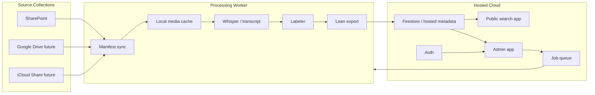

# Publishing And Multi-Team Roadmap

## Purpose

This document defines how to publish Ski Video Companion beyond a local Mac workflow and how to divide the next phases across agent teams.

The current app is a local-first Express/Node app with a JSON store, local media/audio/transcript cache, SharePoint discovery, Live-Timing correlation, Whisper transcription, and deterministic athlete labeling. That architecture has been useful for fast iteration, but publishing requires separating three concerns:

1. Public read-only discovery for families.
2. Admin/indexing workflows for operators.
3. Heavy media processing, which may still run best on a controlled worker machine.

The design below keeps video hosting out of scope. Public playback should link directly to original provider URLs, not proxy video bytes through the app server.

## Recommended Direction

Use a two-app architecture:

- `Public Search App`: a lean, read-only app backed by exported metadata or Firestore.
- `Admin App`: authenticated UI for teams, events, review, processing jobs, source connectors, and publishing.
- `Worker`: local Mac worker first, later Cloud Run/GPU worker where feasible. It owns download, audio extraction, Whisper, and indexing jobs.

The fastest production path is:

1. Publish a static read-only app from `data/exports/lean-index.json`.
2. Add auth-gated admin routes backed by Firestore.
3. Keep processing on the Mac through a queue/polling worker until cloud GPU processing is justified.
4. Uplevel the data model from one TPT U14 collection to multi-team, multi-season, multi-source collections.

## Architecture Alternatives

### Option A: Static Lean App

Use the existing export:

```sh
npm run cli -- export-lean
```

Publish only:

- static HTML/CSS/JS
- `lean-index.json`
- no local media
- no credentials
- no admin APIs

Hosting candidates:

- Firebase Hosting
- Vercel static deployment
- Cloudflare Pages
- GitHub Pages for internal/simple use

Pros:

- Lowest cost and operational risk.
- No backend attack surface.
- Fast to launch.
- Good enough for families searching athlete names.

Cons:

- No live admin management.
- Requires manual or automated export/deploy after indexing updates.
- Search is client-side unless a hosted search service is added.

Recommendation: implement first.

### Option B: Next.js App Router On Vercel Or Firebase App Hosting

Port the UI/API to a modern full-stack framework:

- Next.js App Router for public routes, admin routes, route handlers, server actions where useful.
- Firestore as metadata store.
- Firebase Auth or simple password gate initially.
- Optional Vercel deployment for the app shell; optional Firebase App Hosting if leaning into Firebase.

Official docs note that Next.js supports App Router and deployment targets, including static export for fully static apps. Vercel is the native zero-config path for Next.js. Firebase recommends Firebase App Hosting for full-stack Next.js apps, while Firebase Hosting can rewrite dynamic traffic to Cloud Run.

Pros:

- Strong framework for public and admin UX.
- Good route boundaries for public/admin/API.
- Easy preview deploys and team collaboration.
- Can still use static export for the public app if desired.

Cons:

- Porting cost from the current Express/static app.
- Long-running media jobs do not fit normal web request lifecycles.
- Serverless runtimes are not ideal for local file caches or GPU transcription.

Recommendation: best long-term web framework, but split processing into separate workers.

### Option C: Existing Express App On Cloud Run

Containerize the current app and deploy it on Cloud Run, Render, Fly, or Railway.

Pros:

- Least code migration for admin UI.
- Express server can stay mostly intact.
- Cloud Run can run a container with predictable Node runtime and longer request/job limits than typical serverless functions.

Cons:

- Still need durable metadata storage; local JSON is not enough.
- Still not ideal for large transient media caches unless using mounted volumes/object storage.
- Admin/public UI remains framework-light.

Recommendation: useful as an intermediate admin deployment, but not the preferred public family-facing app.

### Option D: Hybrid Current App + Hosted Metadata

Keep local Express/CLI as the processing cockpit. Sync metadata to Firestore. Build a hosted public app that reads Firestore.

Pros:

- Minimal disruption to working Mac pipeline.
- Good separation between heavy processing and publishing.
- Lets families use the hosted app while operators keep using the proven local workflow.

Cons:

- Admin is not fully web-native yet.
- Requires sync discipline and schema migrations.

Recommendation: best near-term practical path after static lean publishing.

## Target System



## Data Model Uplevel

The current store is effectively single-team. Move toward this hierarchy:

```text
Organization
  Team
    Season
      SourceCollection
      EventFolder
        Video
        RaceAsset
        CandidateRoster
        Job
        ReviewAnnotation
```

### Organization

```json
{
  "id": "org_palisades",
  "name": "Palisades Tahoe",
  "createdAt": "2026-05-14T00:00:00.000Z"
}
```

### Team

```json
{
  "id": "team_tpt_u14_2025_2026",
  "orgId": "org_palisades",
  "name": "TPT U14",
  "clubAliases": ["TPT", "TPTA", "Palisades Tahoe"],
  "ageClass": "U14",
  "defaultSeasonId": "season_2025_2026",
  "visibility": "private | public"
}
```

### Season

```json
{
  "id": "season_2025_2026",
  "teamId": "team_tpt_u14_2025_2026",
  "label": "2025-2026",
  "startsOn": "2025-07-01",
  "endsOn": "2026-06-30"
}
```

### SourceCollection

```json
{
  "id": "source_tpt_sharepoint_u14_2025_2026",
  "teamId": "team_tpt_u14_2025_2026",
  "seasonId": "season_2025_2026",
  "provider": "sharepoint | google_drive | icloud | manual",
  "displayName": "Team Palisades Tahoe Shared U14",
  "rootUrl": "https://...",
  "authMode": "public_shared_link | oauth | service_account | manual",
  "status": "active | disabled",
  "createdAt": "2026-05-14T00:00:00.000Z"
}
```

### EventFolder

Add team/source fields to existing folder records:

```json
{
  "id": "folder_...",
  "orgId": "org_palisades",
  "teamId": "team_tpt_u14_2025_2026",
  "seasonId": "season_2025_2026",
  "sourceCollectionId": "source_tpt_sharepoint_u14_2025_2026",
  "name": "GS Race Jan 10. Northstar Day 2",
  "eventMatch": {},
  "publishStatus": "draft | published | hidden"
}
```

### Video

Add team/source fields and separate playback policy:

```json
{
  "id": "video_...",
  "orgId": "org_palisades",
  "teamId": "team_tpt_u14_2025_2026",
  "seasonId": "season_2025_2026",
  "folderId": "folder_...",
  "sourceCollectionId": "source_tpt_sharepoint_u14_2025_2026",
  "sourceProvider": "sharepoint",
  "sourceUrl": "https://...",
  "downloadUrl": "https://...",
  "playbackUrl": "https://...",
  "localVideoPath": "data/media/...",
  "localVideoPlayable": false,
  "publishStatus": "published | hidden | review_only"
}
```

For public publishing, include `playbackUrl` but not `downloadUrl`, local paths, or private credentials.

## Phase 1: Public Read-Only Lean View

### Goal

Families can search by athlete name and browse event videos without installing anything.

### Functional Requirements

- Read `lean-index.json` or Firestore public collections.
- Search athlete names, fuzzy labels, transcript snippets, event names.
- Browse events chronologically.
- Filter by team, season, event, athlete, status.
- Show athlete labels with confidence and evidence.
- Link playback directly to provider source URL.
- Do not expose download URLs, local paths, raw transcripts if privacy sensitive, or admin actions.
- Optional: per-athlete shareable URL, e.g. `/team/tpt-u14/athletes/sam-mogari`.

### Non-Functional Requirements

- Static hosting friendly.
- Mobile-first for family use.
- No server-side video proxying.
- No secret environment variables required.
- Bundle size stays reasonable; if `lean-index.json` grows, split by team/season/event.

### Implementation Path

1. Extend `export-lean` to emit:
   - `teams.json`
   - `events.json`
   - `videos.json` or per-event files
   - `search-index.json`
2. Build static public UI from current `public/` code or a Next.js static export.
3. Add publish script:

```sh
npm run cli -- export-lean
npm run build:public
npm run deploy:public
```

4. Add CI/manual deploy from a clean exported artifact.

### Acceptance Criteria

- Public URL loads without credentials.
- Searching a known athlete returns matching videos.
- Results link to original SharePoint/source URL.
- No `data/media`, `data/audio`, `data/transcripts`, local paths, or download URLs are included in deployed assets.
- Lighthouse/mobile smoke passes for core pages.

## Phase 2: Hosted Admin App

### Goal

Operators can manage teams/events, run processing jobs, review labels, and publish changes from a hosted admin interface.

### Key Design Constraint

Heavy processing should not run inside normal web requests. Web admin should enqueue jobs; workers execute jobs and stream logs/status.

### Admin Capabilities

- Source collection management.
- Event discovery and manifest refresh.
- Live-Timing correlation.
- Prepare/relabel without media downloads.
- Process/reprocess jobs.
- Manual review and bulk annotation.
- Publish/hide events and videos.
- Job logs and artifacts.
- Team/season management.

### Plausible Implementation Path

#### Step 2A: Hosted Admin UI, Local Worker

- Admin writes jobs to Firestore.
- Mac worker polls `jobs` collection or listens through Firestore.
- Worker runs existing pipeline locally.
- Worker writes status/logs/results back to Firestore.
- Admin UI shows live progress.

This keeps Whisper/Metal and local SharePoint session handling on the Mac while making management web-accessible.

#### Step 2B: Cloud Worker For Non-GPU Tasks

Move low-data tasks to Cloud Run:

- list source folders
- refresh manifests
- Live-Timing fetch/correlation
- metadata relabel
- exports/sync

Keep Whisper/media download on Mac until cloud cost and credentials are clear.

#### Step 2C: Cloud Media Processing

If needed:

- Cloud Run Jobs or batch workers for CPU transcription.
- GPU-capable cloud worker for Whisper if available and cost acceptable.
- Object storage for temporary media cache with lifecycle deletion.
- Strict no-video-hosting policy for public app.

### Admin Backend Requirements

- Durable metadata DB: Firestore recommended for current code direction.
- Job queue model with idempotent job steps.
- Log streaming/polling endpoint.
- Role checks on all mutations.
- Source connector credentials encrypted and scoped per team.

### Acceptance Criteria

- Admin user can create/select team and source collection.
- Admin can trigger `Prepare` and see logs update.
- Admin can trigger processing through local worker and see result counts.
- Admin can manually correct labels and publish changes.
- Public view updates after publish.

## Phase 3: Authentication

### Goal

Public read-only access can remain open or link-limited. Admin access must be gated.

### Phase 3A: Simple Password Gate

Use when speed matters more than user management.

- `ADMIN_PASSWORD_HASH` environment variable.
- Login form posts password.
- Server issues signed httpOnly session cookie.
- Admin routes require session.
- Public routes do not require auth.

Limitations:

- Shared password has weak auditability.
- No per-user access control.
- Rotation is manual.

### Phase 3B: Firebase Auth

Use for production admin.

- Email/password, Google, or Microsoft login.
- Custom claims or Firestore role documents.
- Roles:
  - `owner`: org/team settings, credentials, users.
  - `admin`: processing, publishing, review.
  - `reviewer`: manual labels and review only.
  - `viewer`: read-only private team access.

### Phase 3C: Provider SSO

Potential future:

- Microsoft Entra ID for SharePoint-connected teams.
- Google Workspace for Google Drive teams.

### Security Requirements

- Never expose provider access tokens to client JS.
- Never deploy raw transcripts or download URLs publicly unless explicitly approved.
- Public app should use `playbackUrl`, not server proxy.
- Admin audit log for publish, delete, manual label, and source credential changes.

## Phase 4: Multi-Team And Multi-Source Support

### Goal

Support multiple teams and seasons, not only TPT U14. Each team can have different source providers and roster conventions.

### Provider Adapter Interface

Each source provider implements:

```ts
interface SourceAdapter {
  provider: "sharepoint" | "google_drive" | "icloud" | "manual";
  listCollections(config): Promise<SourceCollection[]>;
  listEventFolders(source): Promise<EventFolder[]>;
  buildManifest(folder): Promise<{ folders: EventFolder[]; videos: Video[] }>;
  getPlaybackUrl(file): string;
  getDownloadUrl(file): string | null;
  discoverTranscripts(file): Promise<TranscriptAsset[]>;
}
```

### Team-Specific Configuration

Each team should define:

- club aliases
- age class
- season boundaries
- source collections
- roster source preferences
- Live-Timing matching hints
- label confidence thresholds
- publish policy

Example:

```json
{
  "teamId": "team_tpt_u14_2025_2026",
  "labeling": {
    "clubAliases": ["TPT", "TPTA"],
    "namePromptLimit": 80,
    "indexedThreshold": 0.65,
    "manualLabelPriority": 100
  },
  "eventMatching": {
    "calendarUrls": ["https://fwskiing.org/events/u14-schedule-results/"],
    "liveTimingEnabled": true
  }
}
```

### Multi-Tenant URLs

Public:

```text
/teams/:teamSlug
/teams/:teamSlug/events/:eventId
/teams/:teamSlug/search?q=
/teams/:teamSlug/athletes/:athleteSlug
```

Admin:

```text
/admin/teams
/admin/teams/:teamId/sources
/admin/teams/:teamId/events
/admin/teams/:teamId/jobs
```

## Publishing Alternatives Matrix

| Path | Public View | Admin View | Processing | Best For |
| --- | --- | --- | --- | --- |
| Static export | Static JSON | none | local Mac | immediate family-facing launch |
| Hybrid Firestore | Firestore public docs | local/admin later | local Mac worker | practical near-term production |
| Next.js + Firestore | Next.js routes | Next.js admin | local/cloud workers | long-term product |
| Express on Cloud Run | Express UI/API | Express admin | local/cloud workers | fastest hosted admin migration |
| Full cloud pipeline | Next.js/Firestore | Next.js admin | Cloud Run/GPU jobs | scale beyond one operator |

Recommended sequence:

1. Static export public view.
2. Hybrid Firestore sync for read-only hosted public data.
3. Auth-gated admin with local worker queue.
4. Multi-team/source abstractions.
5. Selective cloud processing.

## Work Packages For Agent Teams

### Team A: Public Lean App

Ownership:

- `public/` or new `apps/public/`
- `src/lib/leanExport` if split from current store export
- public deployment scripts

Deliverables:

- Static family-facing search/browse UI.
- Per-team/per-season routing.
- Direct playback links only.
- Mobile responsive event and search result layouts.

Tasks:

- Define lean export schema v2.
- Split large index into chunks if needed.
- Build client search index.
- Add `publishStatus` filtering.
- Add smoke tests for no private fields.

Acceptance:

- Public app deploys from lean export.
- No local paths, download URLs, or secrets in generated files.

### Team B: Metadata Backend

Ownership:

- Firestore schema
- sync/export/import tooling
- migration scripts

Deliverables:

- Firestore collection schema for org/team/season/source/event/video/job/review.
- Local JSON to Firestore sync.
- Firestore to lean export path.
- Schema versioning and migration plan.

Tasks:

- Add `teamId`, `seasonId`, `sourceCollectionId` to records.
- Implement idempotent upserts.
- Add validation command.
- Document indexes needed for query patterns.

Acceptance:

- Current TPT U14 data syncs into team-scoped collections.
- Queries can fetch event list, event detail, search results, and job logs by team.

### Team C: Admin UI And Auth

Ownership:

- admin routes/pages
- session/auth middleware
- user roles

Deliverables:

- Simple password auth first.
- Admin shell with team selector.
- Event/source/job management pages.
- Review and publish controls.

Tasks:

- Add `ADMIN_PASSWORD_HASH` gate or Firebase Auth.
- Split public and admin navigation.
- Add role checks to mutation endpoints.
- Add audit logs for admin actions.

Acceptance:

- Anonymous user cannot access admin routes or mutation APIs.
- Admin can run prepare/reprocess and review labels.

### Team D: Worker And Job Queue

Ownership:

- processing worker
- job queue schema
- log streaming/polling
- local Mac runner

Deliverables:

- Worker process that polls Firestore/local queue.
- Job step state machine.
- Retry and cancellation.
- Local worker install/run docs.

Tasks:

- Extract current `processFolder` into worker-safe job handlers.
- Add job locks/leases.
- Add structured job logs.
- Support `prepare`, `process`, `reprocess`, `publish`.

Acceptance:

- Admin can enqueue a job.
- Worker claims it, updates logs, writes results, and marks completion.
- Duplicate workers do not process the same job concurrently.

### Team E: Source Adapters And Multi-Team

Ownership:

- provider adapter interface
- SharePoint adapter refactor
- Google Drive/iCloud exploration
- team config

Deliverables:

- `SourceAdapter` abstraction.
- Existing SharePoint logic moved behind adapter.
- Team/source config UI or JSON seed.
- Google Drive feasibility prototype.

Tasks:

- Normalize manifest output across providers.
- Add source capability flags: `canList`, `canDownload`, `hasStablePlaybackUrl`, `hasTranscript`.
- Add provider-specific credential storage design.

Acceptance:

- TPT SharePoint flow still works through generic source adapter calls.
- A second team/source can be configured without code changes to core pipeline.

### Team F: Deployment And DevOps

Ownership:

- hosting choice
- CI/CD
- environments
- secrets
- observability

Deliverables:

- Public preview deploy.
- Production deploy.
- Admin staging deploy.
- Environment variable docs.
- Backup/restore plan.

Tasks:

- Choose static hosting for Phase 1.
- Add deploy scripts.
- Add CI checks: smoke, audit-media-links, lean-export-private-field check.
- Add Firestore backup/export docs.

Acceptance:

- `main` can publish public app from a clean export.
- Rollback is documented.
- Secrets are not committed.

### Team G: QA And Data Integrity

Ownership:

- validation commands
- browser tests
- data audit reports

Deliverables:

- Link audit.
- Private-field audit.
- Label confidence audit.
- Event/source consistency audit.

Tasks:

- Extend `audit-media-links`.
- Add `audit-public-export`.
- Add Playwright/browser smoke for search and event pages.
- Add regression case for dataless local file.

Acceptance:

- Published artifact passes all audits.
- Known examples like `P1000316.MP4` are covered by regression tests.

## API Surface Draft

Public:

```http
GET /api/public/teams
GET /api/public/teams/:teamId/events
GET /api/public/teams/:teamId/events/:eventId
GET /api/public/teams/:teamId/search?q=
```

Admin:

```http
POST /api/admin/login
POST /api/admin/logout
GET  /api/admin/me
GET  /api/admin/teams
POST /api/admin/teams
GET  /api/admin/teams/:teamId/sources
POST /api/admin/teams/:teamId/sources
POST /api/admin/events/:eventId/prepare
POST /api/admin/events/:eventId/process
POST /api/admin/events/:eventId/reprocess
POST /api/admin/events/:eventId/publish
POST /api/admin/videos/:videoId/review
GET  /api/admin/jobs/:jobId
```

Worker:

```http
POST /api/worker/jobs/:jobId/claim
POST /api/worker/jobs/:jobId/log
POST /api/worker/jobs/:jobId/complete
POST /api/worker/jobs/:jobId/fail
```

For Firestore-backed worker queues, these can be direct Firestore writes instead of HTTP endpoints.

## Deployment Process Drafts

### Static Public Publish

```sh
npm run smoke
npm run cli -- audit-media-links
npm run cli -- export-lean
npm run build:public
npm run deploy:public
```

Add `audit-public-export` before deploy:

- fail if any key matches `localPath`, `localVideoPath`, `localAudioPath`, `downloadUrl`, `graphAccessToken`, `cookies`.
- fail if any value contains `/Users/` or `data/media`.

### Hybrid Firestore Publish

```sh
METADATA_BACKEND=firebase npm run cli -- sync-metadata
npm run deploy:public
```

Public app reads Firestore or a generated JSON bundle from Firestore export.

### Admin With Local Worker

```sh
npm run deploy:admin
npm run worker -- --team team_tpt_u14_2025_2026
```

The worker needs:

- source provider credentials or public links
- local data cache path
- Whisper binaries/models
- Firestore service account or worker token

## Risks And Mitigations

### SharePoint Links Require Login

Risk: direct file URLs may not be truly anonymous even if the folder link is public. For the current TPT U14 folder share, the root folder link opens anonymously from a fresh browser state, but raw file URLs and SharePoint's own `:v:/r/...` direct file URL can return `403` with `x-forms_based_auth_required` until the browser has opened the root shared folder. File-level `GetSharingInformation` for `P1000316.MP4` showed no existing per-file anonymous link (`anonymousLinkAbilities.canGetReadLink.enabled=false`, `anyoneLinkAbilities.canGetReadLink.enabled=false`, `mainLinkAbilities=null`).

Mitigation:

- Store both `sharepointUrl` and provider-specific link metadata.
- Test public playback in an incognito/no-cookie browser before publishing, and verify page content rather than trusting HTTP 200 alone.
- For Phase 1, tell viewers to open the public source folder once, then use direct item links from the public app.
- If authenticated Microsoft Graph access is available and tenant policy allows it, generate true file-level anonymous links with Graph `driveItem:createLink` and publish those links.
- If direct source URLs fail, use provider-supported sharing links, not app-server byte proxy.

### Heavy Processing In Web Runtime

Risk: serverless functions time out or lack GPU/local disk.

Mitigation:

- Use job queue and workers.
- Keep Mac worker for media/transcription initially.
- Move only low-data tasks to cloud first.

### Privacy

Risk: transcript snippets and racer labels may expose more than intended.

Mitigation:

- Publish only reviewed events by default.
- Add `publishStatus`.
- Add export audit for private fields.
- Consider hiding transcript snippets in public view until reviewed.

### Multi-Team Data Mixing

Risk: search leaks one team’s data into another team’s UI.

Mitigation:

- Require `teamId` on all records.
- Scope every query by team.
- Add audit for missing `teamId`.

## Open Decisions

- Public app framework: current static app vs Next.js static export.
- Hosting provider for Phase 1: Firebase Hosting, Vercel, Cloudflare Pages.
- Admin framework: keep Express short-term or port to Next.js.
- Auth provider: simple password first vs Firebase Auth immediately.
- Metadata store: continue local JSON plus static export, or make Firestore primary for published environments.
- SharePoint direct playback reliability for anonymous users.

## References

- Next.js App Router docs: https://nextjs.org/docs/app
- Next.js deployment docs: https://nextjs.org/docs/app/getting-started/deploying
- Vercel Next.js docs: https://vercel.com/docs/concepts/next.js/overview
- Firebase Hosting + Cloud Run rewrites: https://firebase.google.com/docs/hosting/cloud-run
- Firebase Next.js integration and App Hosting guidance: https://firebase.google.com/docs/hosting/frameworks/nextjs
- Firebase App Hosting framework support: https://firebase.google.com/docs/app-hosting/frameworks-tooling
